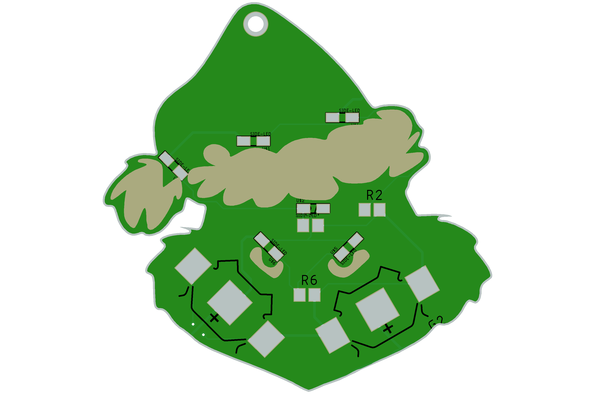

## ⭐ Grinch Christmas PCB badge

Este projeto é um belíssimo adorno para árvore de natal no formato de uma figura icônica e muito natalina.

Esta placa de circuito impresso foi desenvolvida usando o [Eagle](https://www.autodesk.com/products/eagle/overview) e permite que LEDs sejam acendidos deixando a sua noite de natal muito mais mágica

## 📝 Esquemático

## ⚙️ Componentes necessários para o projeto (BOM LIST)

A lista de componentes necessários para a montagem desta placa está listado abaixo:

## 🤝 Parcerias
Este projeto foi desenvolvido em parceria com:

## 📹 Vídeos relacionados
Veja alguns vídeos que produzi relacionados a este projeto:
- [SOLDA DE LEDS INVERTIDOS](https://www.youtube.com/watch?v=TsmJABV-Md8)

## 💳 Gostaria de adquirir uma dessas placas?
O projeto também está disponível no compartilhamento da PCBWay, e você pode encomendá-lo por lá [clicando aqui](https://www.pcbway.com/project/shareproject/Grintch_XMAS_PCB.html).

